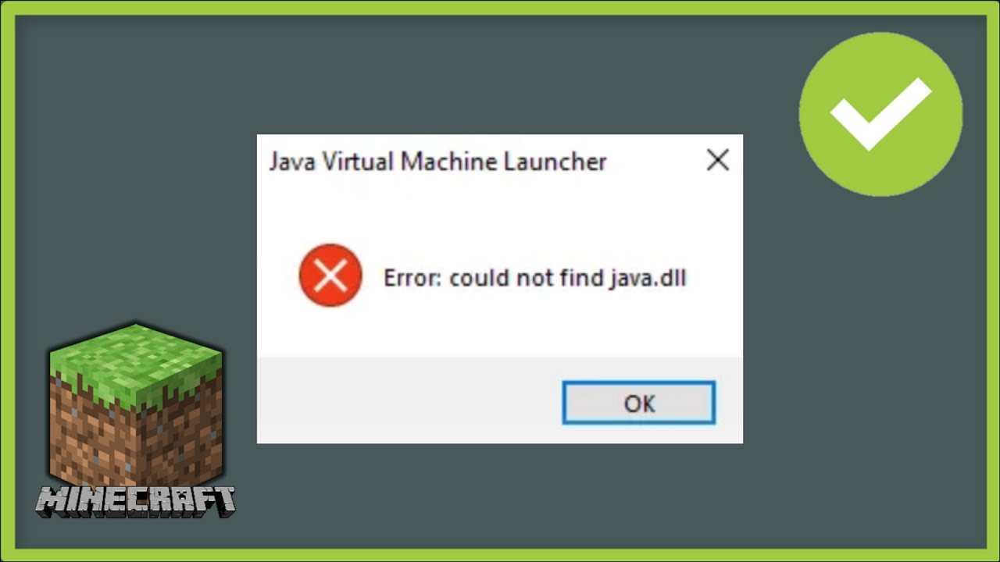

# Quy trình xử lý khi gặp vấn đề hoặc lỗi
### Bước 1: Hãy lên google tìm kiếm coi đã có người dính phải lỗi giống bạn hay chưa (nên tra bằng tiếng anh).
```
<tên lỗi đó hoặc miêu tả lỗi đó> error
How to <thứ bạn muốn làm>
```
Lưu ý:
* Bạn nên tra bằng tiếng anh và không nhất thiết phải đúng ngữ pháp.
    * `edge auto switch between 2 tab error`
    * `How to change background in windows 11`
    * `How to turn off windows defender`

* Khi có lỗi xẩy ra thì sẽ thường có tên lỗi nếu không thì hãy miêu tả nó
    * VD: `could not find java.dill error`



### Bước 2: Hãy tìm kiếm các trang web được hiển thị ra và đọc chúng, hoặc có thể chuyển qua mục video mà coi video hưỡng dẫn

### Bước 3: Nếu không tìm lỗi
Không trường hợp không tìm được lời giải thì khả năng cao là bạn đã tra sai cách (thường là do miêu tả chưa kĩ) tại vì việc bạn gặp một lỗi mà chưa có người nào gặp lf gần như không thể. Việc của bạn là hãy miêu tả kĩ lỗi, từ việc bạn gặp lỗi khi nào và dùng ứng dụng nào,...

### Bước 4: Nếu như đã tìm ra người cũng bị dính lỗi giống bạn nhưng không có giải pháp
Lúc này chỉ có cách là bạn hãy tự tìm hiểu và tự giải quyết. Hoặc bạn có thể đăng lên các trang hỏi đáp như là [stackoverflow (nếu liên quan đến lập trình)](https://stackoverflow.com/), và các forum của ứng dụng bạn dùng.
